# warpseed — User Guide

warpseed is a fast, free transfer client for Windows built for seedbox
workloads: parallel connections, byte-level resume that survives errors
and restarts, and a queue you can leave running overnight.

This guide covers everything in version 1.0. If something here doesn't
match what you see, that's a bug — [report it](#getting-help).

---

## Contents

1. [Install](#install)
2. [First connection](#first-connection)
3. [The four views](#the-four-views)
4. [Browsing and transferring](#browsing-and-transferring)
5. [The queue](#the-queue)
6. [Hyperlane — multi-connection transfers](#hyperlane--multi-connection-transfers)
7. [Mini mode](#mini-mode)
8. [Settings](#settings)
9. [Keyboard reference](#keyboard-reference)
10. [Where your data lives](#where-your-data-lives)
11. [Troubleshooting](#troubleshooting)
12. [Getting help](#getting-help)

---

## Install

**Requirements:** Windows 10 or 11, 64-bit, with WebView2 (preinstalled on
Windows 11). If WebView2 is missing, warpseed offers to download it from
Microsoft on first run — that is the only connection the app ever makes
that isn't to a server you configured.

1. Download `warpseed.exe` from the
   [latest release](https://github.com/ZyraLabs/warpseed/releases/latest).
2. Put it anywhere — it's portable. No installer, no admin rights, no
   accounts, no telemetry.
3. Double-click to run.

**SmartScreen prompt.** The binary is currently unsigned, so Windows may
show "Windows protected your PC" the first time. Click **More info → Run
anyway**. To check you have a genuine build, compare the file's SHA-256
against `SHA256SUMS.txt` published alongside every release:

```powershell
Get-FileHash .\warpseed.exe -Algorithm SHA256
```

**Updating.** Download the new `warpseed.exe` and replace the old one. Your
sites, queue and settings are stored separately (see
[Where your data lives](#where-your-data-lives)) and carry over.

---

## First connection

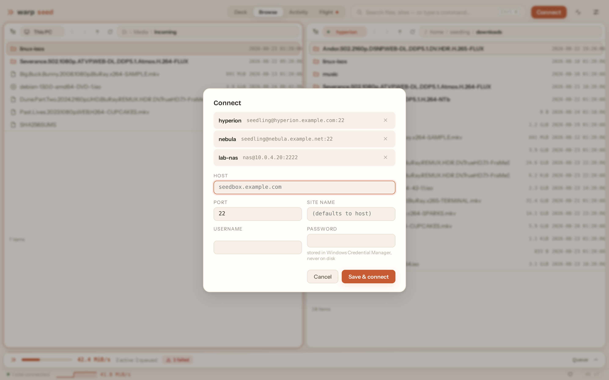

Click **Connect** in the header (or press **Ctrl+K** and choose **New
connection…**). Pick a saved site, or fill in a new one:

| Field | Notes |
|---|---|
| **Host** | e.g. `hyperion.example.com` |
| **Port** | `22` unless your provider says otherwise |
| **Site name** | Optional label; defaults to the host |
| **Username / Password** | The password is stored in **Windows Credential Manager**, never in a file |
| **Initial remote path** | Where the remote pane opens, e.g. `/home/you/downloads` |

Press **Connect**. Saved sites appear in the command palette (Ctrl+K →
"Connect: *name*") and can be edited later under **Settings → Sites**.

### Host key check

The first time you reach a server, warpseed shows its SSH host-key
fingerprint and asks you to **Trust & connect**. Compare it with the
fingerprint your seedbox provider publishes. After that the key is pinned:
if it ever changes, warpseed refuses to connect and tells you loudly —
that is the one situation where you should stop and check with your
provider before doing anything else.

> **SFTP only, password auth only** in 1.0. SSH keys/agent, FTP/FTPS, S3
> and WebDAV are planned.

---

## The four views

Switch views with the **Deck · Browse · Activity · Flight** control in the
header. The search box beside it is the command palette (**Ctrl+K**).

### Deck — the night's work at a glance

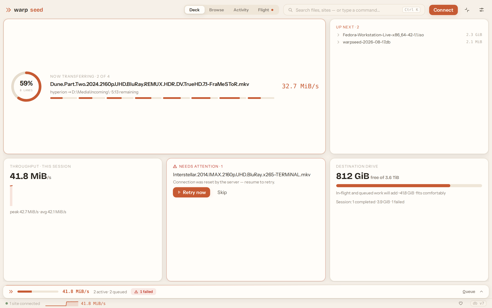

A dashboard: what's moving now, aggregate speed, what finished, what
failed. Open it in the morning to audit an overnight run.

### Browse — dual-pane commander

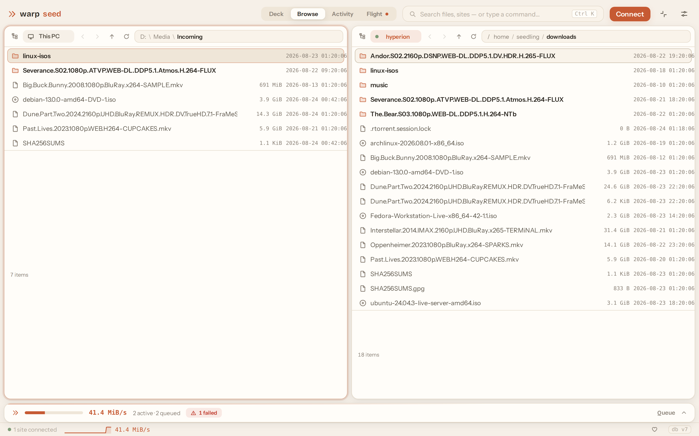

Two panes, each either your PC or a remote site. This is where you pick
files and start transfers. If you've used WinSCP, Total Commander or
Norton Commander, your hands already know it.

### Activity — the session as a story

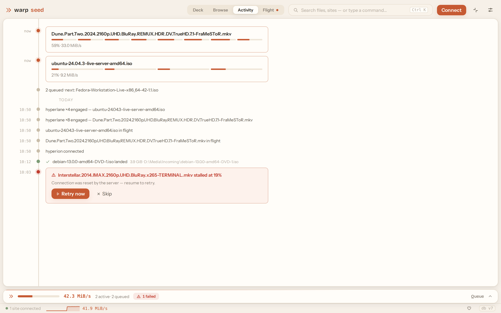

A timeline of everything that happened this session — connections,
transfers starting, finishing, retrying — in order.

### Flight — the pipeline, live

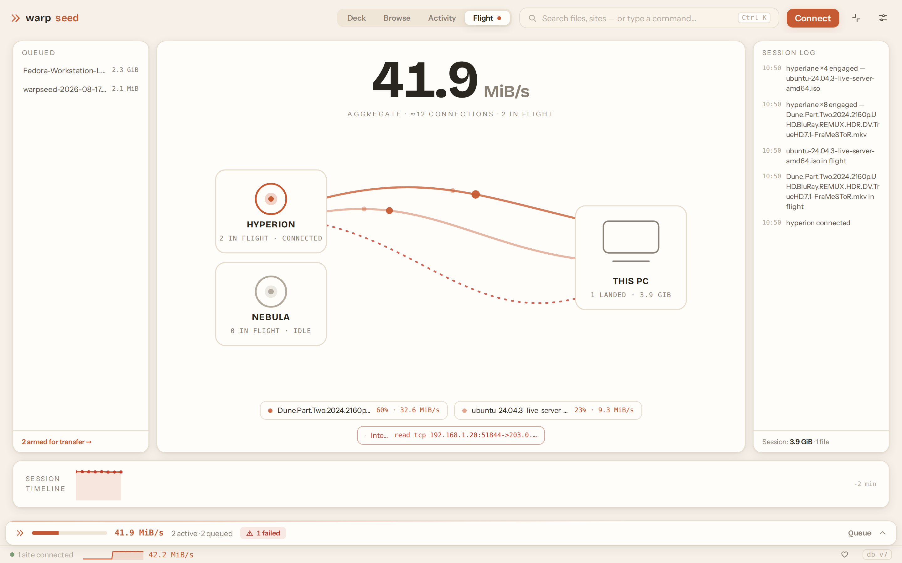

A live picture of each active transfer and its connections while data is
flowing. Appears once something is transferring.

---

## Browsing and transferring

- **Tab** switches the active pane. The active pane carries the accent
  colour.
- **Enter** opens a folder; **Backspace** goes up. **Ctrl+L** turns the
  breadcrumb into an editable path.
- **Ctrl+F** filters the listing as you type. **Esc** clears it.
- Click column headers to sort by name, size or date.
- **Switch a pane to This PC** or to a site from the command palette
  (Ctrl+K), or from the pane's source picker.

### Selecting

Two mechanisms coexist, commander-style:

- The **cursor** — one row, moved with the arrow keys.
- **Marks** — a sticky multi-selection. **Insert** marks the row and
  advances; **Space** marks without advancing; **\*** inverts;
  **Ctrl+Shift+A** clears. Ctrl+click and Shift+click work as you'd
  expect. The pane footer shows a running total of what's marked.

Transfers act on the marks if there are any, otherwise on the cursor row.

### Transferring

- **F5** — transfer the selection to the other pane (download if the
  active pane is remote, upload if it's local). Items go straight into
  the queue and start as soon as a slot is free.
- **F7** — new folder · **F2** — rename · **F8** / **Delete** — delete
  (with confirmation).
- Right-click any row for the same actions as a context menu.

Downloads are written into the destination folder and confined to it —
a hostile filename on the server can't escape it.

---

## The queue

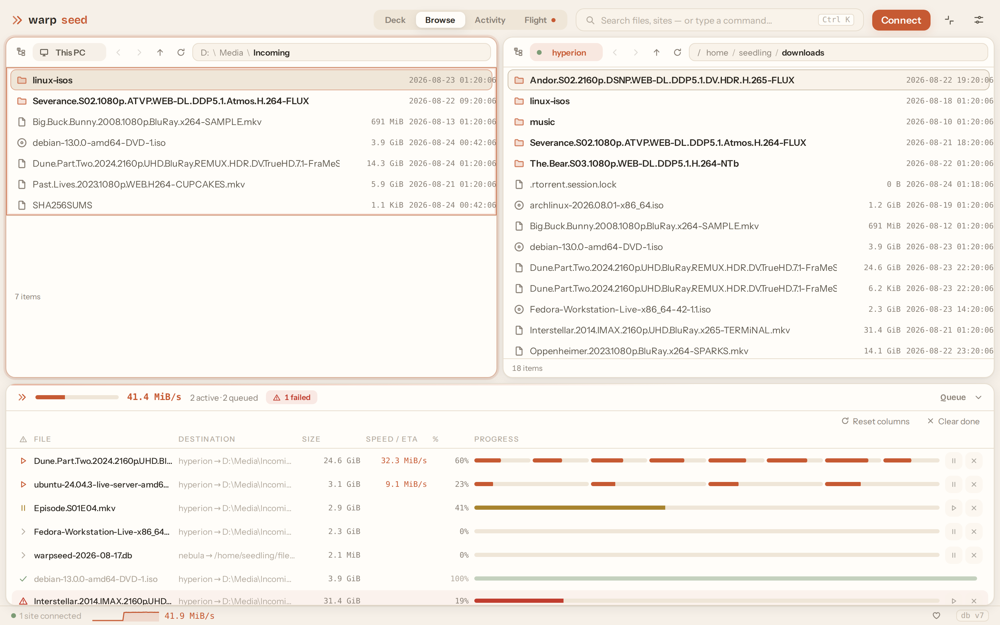

The queue dock lives at the bottom of the window and is never hidden. Even
collapsed it shows aggregate speed and counts; click it to expand.

Each row shows filename, route, progress, speed and ETA, and has
**pause / resume** and **cancel** buttons. Items from different sites
coexist. The queue is persisted to disk, so closing warpseed (or a crash,
or a reboot) loses nothing — on next launch, unfinished transfers are
still there and resume from the exact byte they reached.

**States:** queued · active · paused · completed · failed. Failed rows
show a plain-language reason and a **retry** button. Completed rows stay
for the session so you can audit them; **Clear done** purges them.

### Byte-level resume

Every transfer keeps per-chunk checkpoints. Pause, error, idle timeout,
network drop, restart — when it resumes, it verifies the checkpoint and
continues from that byte. No re-downloading a 40 GB file because the
connection blinked at 39 GB.

---

## Hyperlane — multi-connection transfers

Most seedboxes cap the speed of **each connection** (commonly ~5 MiB/s)
rather than your account. A single-connection client can never beat that
cap on a single file.

Hyperlane splits one large file across several connections — up to 16
"lanes" — each pulling its own byte range into the same pre-allocated
file. Eight lanes at 5 MiB/s each is 40 MiB/s for one file. In the queue,
a Hyperlane transfer shows a segmented progress bar, one segment per lane.

Configure it under **Settings → Hyperlane**:

- **Lanes per file** — 1–16 connections (1 = off). Start at 8; if your
  provider limits connections per IP, stay under that limit.
- **Engage above** — files smaller than this (default 256 MB) use a single
  connection, since lane setup costs more than it saves on small files.

Remember that lanes count against your per-site connection cap (see
[Settings → Transfers](#settings)).

---

## Mini mode

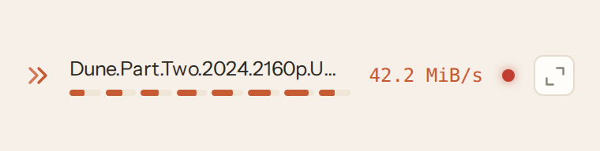

Click **Minimize to pill** in the header and warpseed shrinks to a small
always-on-top strip showing live transfer state. Work in other windows and
keep an eye on the run. Click the pill or press **Escape** to bring the
full window back.

---

## Settings

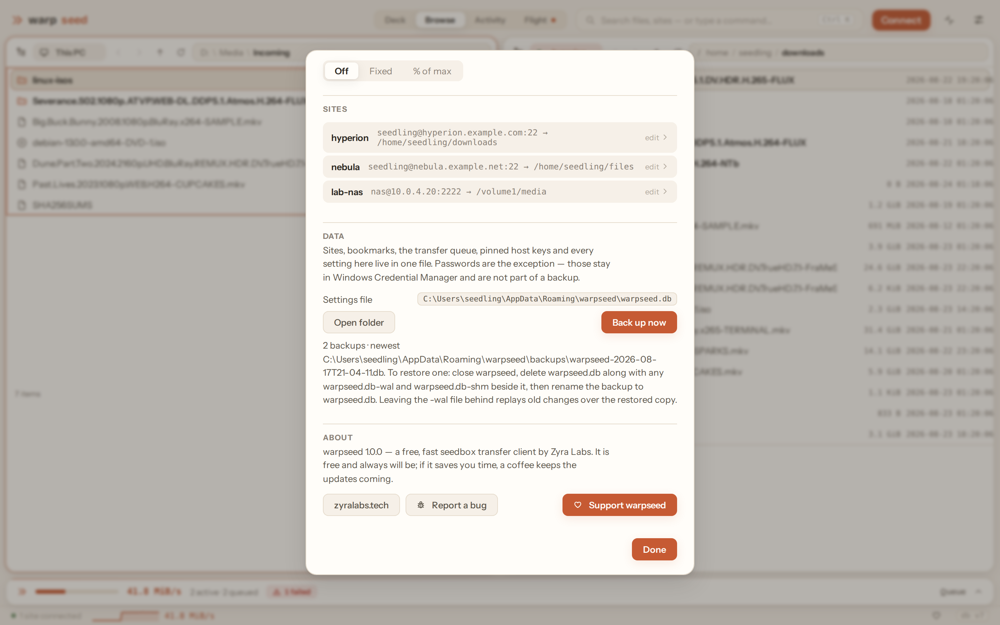

Open with **Ctrl+,** or the gear icon.

**Appearance** — three themes: **Clay** (default, warm light),
**Cobalt** (cool light) and **Iris** (dark).

| Cobalt | Iris |
|---|---|
| 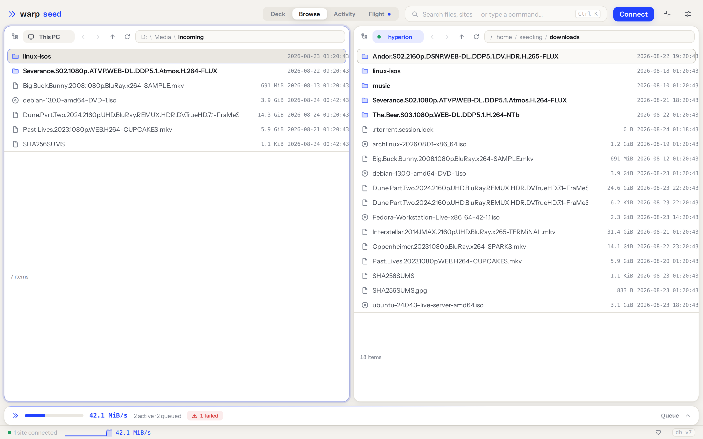 | 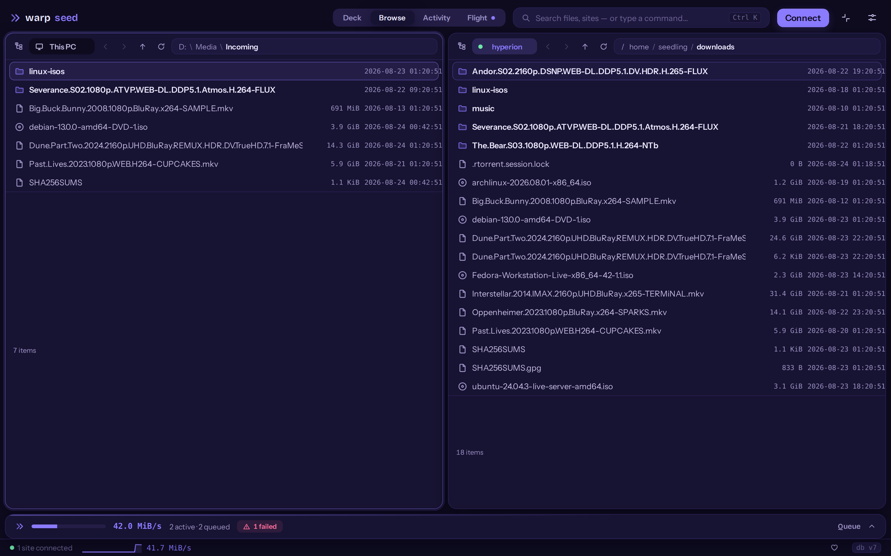 |

**Transfers**
- *Concurrent transfers (all sites)* — how many files move at once across
  every site (1–16, default 6).
- *Per-site default* — connection cap per site (1–8, default 3). Sites can
  override this individually.

**Hyperlane** — see [above](#hyperlane--multi-connection-transfers).

**Bandwidth** — *Off*, *Fixed* (a MiB/s ceiling), or *% of max* (throttle
to a percentage of your measured maximum, so a big run doesn't flatten
the rest of your network).

**Sites** — edit or delete saved sites: name, host, port, username,
password, initial remote path, and a per-site max-transfers override.

**Data** — shows where the settings/queue database lives, with buttons
to open that folder and to make a backup copy.

**About** — version, links to zyralabs.tech, **Report a bug** (opens an
email to warpseed@zyralabs.tech with the version pre-filled), and
**Support warpseed**.

---

## Keyboard reference

| Key | Action |
|---|---|
| **Tab** | Switch active pane |
| **Enter** | Open folder |
| **Backspace** | Parent folder |
| **Ctrl+L** | Edit path |
| **Ctrl+F** | Filter listing (Esc clears) |
| **Ctrl+R** | Refresh listing |
| **Insert** | Mark and advance |
| **Space** | Mark (no advance) |
| **\*** | Invert marks |
| **Ctrl+Shift+A** | Deselect all |
| **F5** | Transfer selection to other pane |
| **F7** | New folder |
| **F2** | Rename |
| **F8** / **Delete** | Delete |
| **Ctrl+K** | Command palette |
| **Ctrl+,** | Settings |
| **Esc** | Clear filter → close dialog → leave mini mode |

The command palette (**Ctrl+K**) lists every command with its shortcut,
plus one-line connect/disconnect for each saved site.

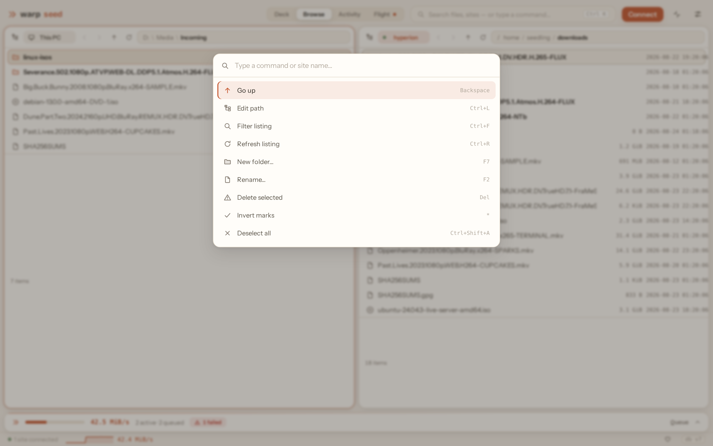

---

## Where your data lives

| What | Where |
|---|---|
| Sites, queue, bookmarks, settings, pinned host keys | `%APPDATA%\warpseed\warpseed.db` (SQLite) |
| Passwords | Windows Credential Manager (`warpseed/*` entries) |
| The app itself | Wherever you put `warpseed.exe` |

**Backup:** Settings → Data → **Back up now** copies the database into a
`backups\` folder beside it, named with a timestamp. To restore, close warpseed, delete `warpseed.db`
**and** any `warpseed.db-wal` / `warpseed.db-shm` beside it, then rename
the backup to `warpseed.db`. (Leaving the `-wal` file behind would replay
old changes over the restored copy.)

**Uninstall:** delete `warpseed.exe`, the `%APPDATA%\warpseed` folder, and
the `warpseed/*` entries in Credential Manager. Nothing else is touched.

---

## Troubleshooting

**"Windows protected your PC"** — see [Install](#install). Verify the
checksum, then More info → Run anyway.

**Blank window on launch** — WebView2 is missing. Install the
[Evergreen WebView2 Runtime](https://developer.microsoft.com/microsoft-edge/webview2/)
from Microsoft, then relaunch.

**Transfers stall at one speed no matter what** — your provider caps each
connection. Turn on Hyperlane (Settings → Hyperlane → Lanes per file: 8)
and raise the per-site connection cap.

**"Too many connections" / logins refused** — the provider limits
simultaneous connections per IP. Lower *Per-site default* and *Lanes per
file* so that lanes × concurrent transfers stays under the limit.

**Host key changed** — warpseed refuses to connect on purpose. If your
provider migrated servers they'll have announced it; confirm with them,
then delete and re-add the site to re-pin the key. If they didn't, don't
connect.

**A transfer keeps failing** — the row shows the reason. Idle timeouts and
resets retry automatically and resume at the byte they reached; if it
exhausts retries, hit retry once the server is responsive again.

**Reset everything** — close warpseed and delete `%APPDATA%\warpseed`.

---

## Getting help

Use **Settings → About → Report a bug**, or email
**warpseed@zyralabs.tech** with what happened, what you expected, and
your warpseed version. Reports are handled on an urgency basis.

warpseed is free and always will be. If it saves you time,
[a coffee keeps the updates coming](https://buymeacoffee.com/zyralabs).

Source: [github.com/ZyraLabs/warpseed](https://github.com/ZyraLabs/warpseed) · MIT © 2026 Zyra Labs
